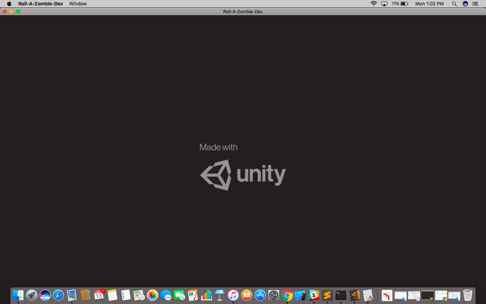
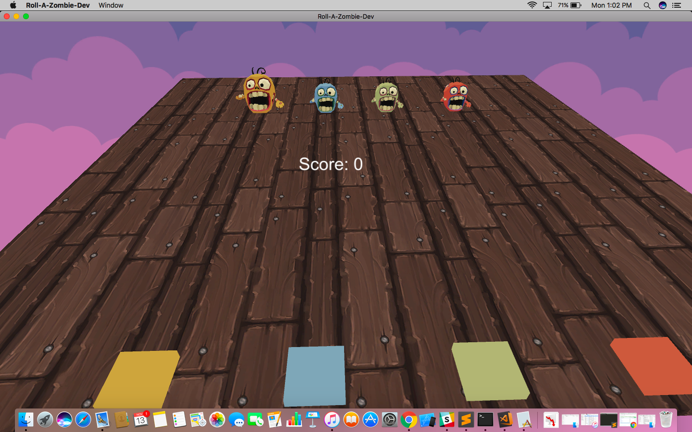
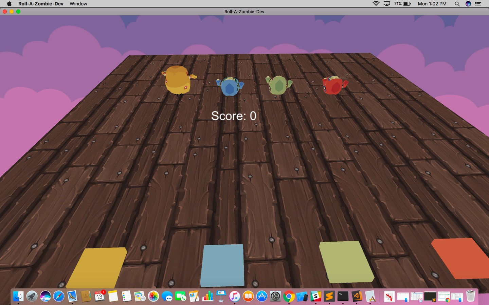
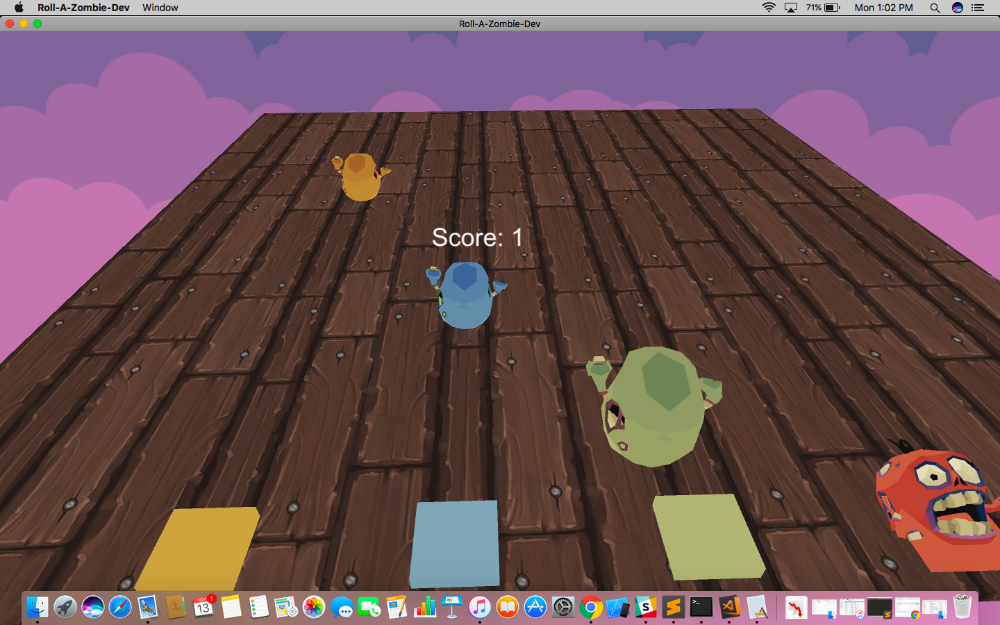
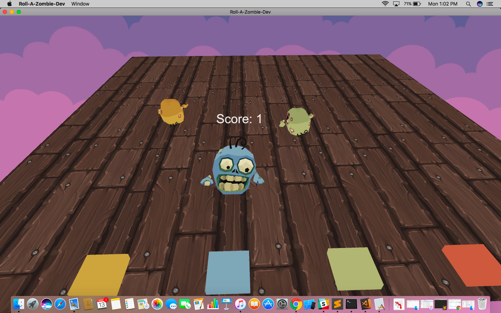
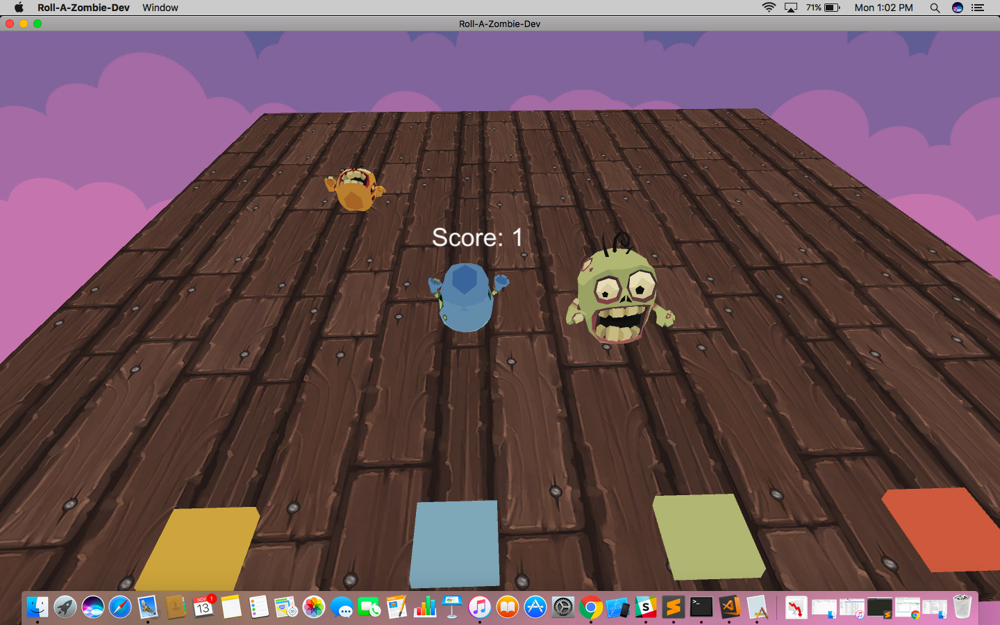
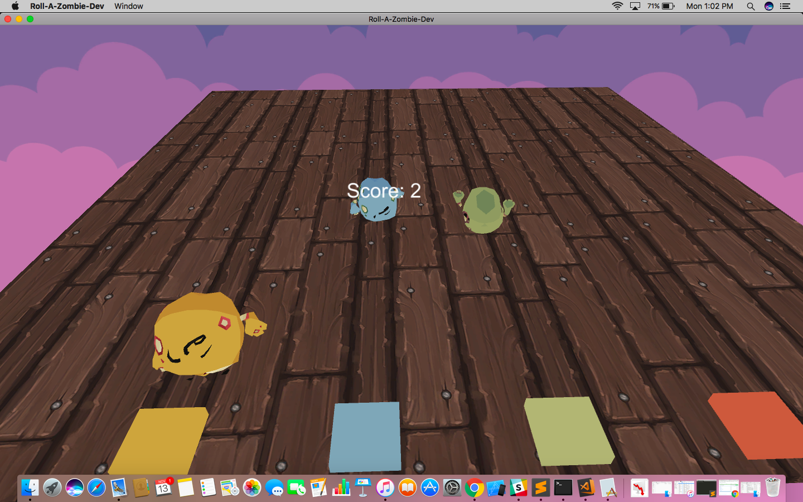

# UnityPhysX Demo

Simple game built in the live coding session of my techtalk for demostration of basics of **_PhysX_**, **_Camera Angles_**, **_Lightning_** and **_Rendering_** using **_Unity3D_**.
This game is a simple roller game  where you have to balance the give object(s) on the target for as long as you can.

## ScreenShots

> Note: The assets are not provieded as I do not have distribution rights over them. GFX were provided by www.bitgem3d.com

## Dependencies

 * Unity3d
 * C#(.Net CLI)

## Getting Started

**1. Install Unity**

[download unity](https://unity3d.com/)
>note: Please download the target platforms compatibility as well through the installer

**2. Clone the repository**

>$ git clone https://github.com/shubham56/UnityPhysXDemo.git

> open the directory using Unity

**3. To start the demo**

>Open the project using unity

>Go to File->Build Settings

>Select the scene to build i.e. Game

>Select the target platform

>Then press Build and run

## Credits

 * [Unity3d](https://unity3d.com/)

 * [C#(.Net CLI)](https://docs.microsoft.com/en-us/dotnet/core/tools/?tabs=netcore2x)

 * [www.bitgem3d.com](https://shop.bitgem3d.com/) for GFX
